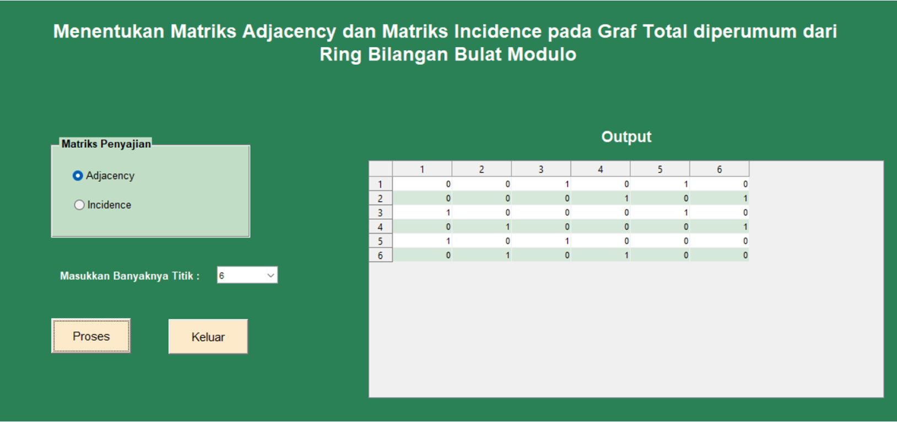
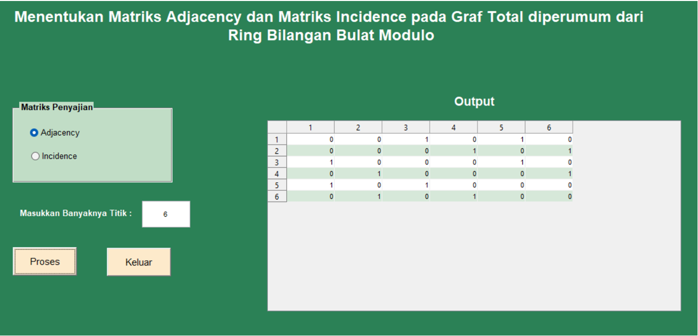

# Generalized Total Graph Matrix Generator

## Overview

This project was developed as a final project for the Algebra Structure Laboratory course. The program generates adjacency matrices and incidence matrices of generalized total graphs derived from modulo integer rings using MATLAB.

Two approaches are provided:

- MATLAB M-File (without GUI)
- MATLAB GUI

---

## Files

- `PROJEKSAP_tanpaGUI.m` : MATLAB script for matrix generation without GUI.
- `GUISAP.fig` and `GUISAP.m` : GUI version with manual input.
- `PROJEKSAP.fig` and `PROJEKSAP.m` : GUI version with predefined inputs (6, 8, 10, and 12).

---

## Technologies Used

- MATLAB
- MATLAB GUIDE
- Graph Theory
- Abstract Algebra

---

## Results

### GUI with Predefined Inputs (6, 8, 10, 12)

This version allows users to select predefined modulo values and generate the corresponding adjacency or incidence matrix.

---

### GUI with Manual Input

This version allows users to enter any valid even integer and automatically generate the corresponding matrix.

---

## Conclusion

This project demonstrates the use of MATLAB to automate the construction of adjacency and incidence matrices for generalized total graphs through both script-based and GUI-based implementations.
